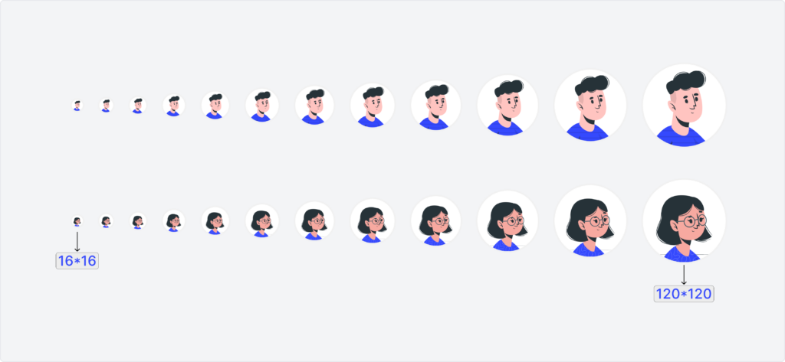

# Avatar
An avatar is a visual representation of a person, used to personalize experiences and enhance user recognition. In our design system, avatars represent users of different genders, providing a simple and clear way to depict individuals within the interface.

---

## Overview
### Types
*  Man
*  Woman

### Usage
Use avatars to attribute actions to users or to anchor their profile information. In a chat context, avatars help build trust and clarify who is speaking in a conversation.

### Size
Avatars are available in sizes ranging from 16 to 120 pixels, providing flexibility for various use cases. Larger sizes (e.g., 120px) are ideal for profile pages, while smaller sizes (e.g., 16px) are suited for compact UI elements like lists or toolbars. Using consistent sizes ensures visual clarity and maintains hierarchy.

