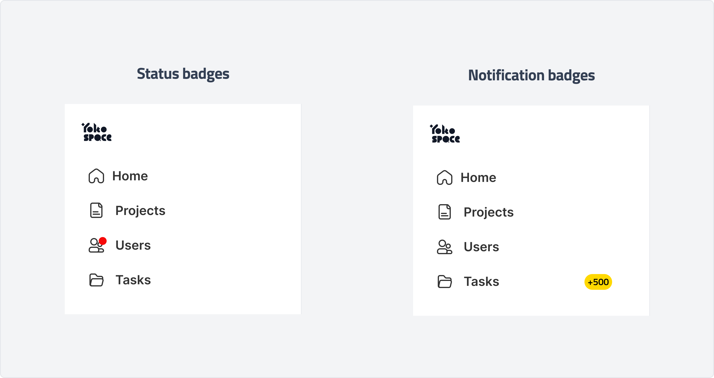
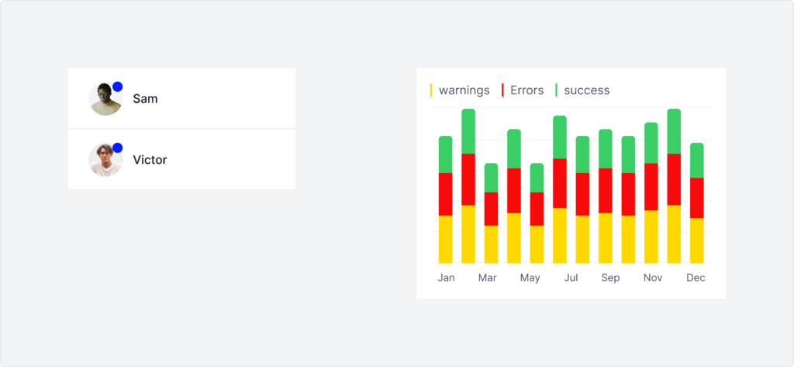
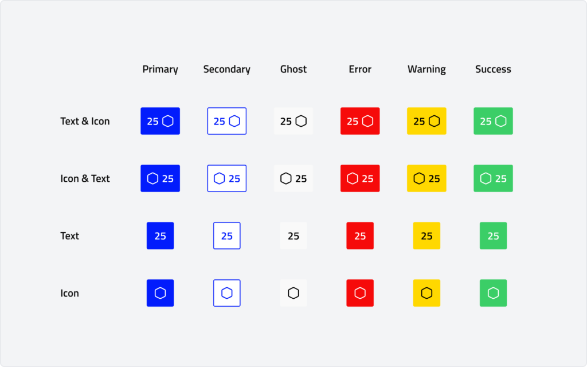
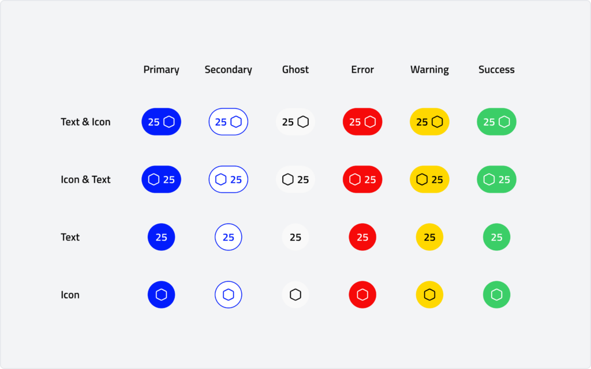

# Badge

Badges are small, visual elements that clearly and concisely communicate status, achievement, or information. They supplement other UI components, adding meaning at a glance.

-----

## Overview

### Types

- **Notification badges**
    - Use a circle or rectangle notification badge to notify, quantify, or indicate a role or status.
- **Status badges**
    - Use a simple shape to indicate newness or current status.

### Anatomy

### Usage

#### Notification badges

Use a circle or rectangle notification badge to notify, quantify, or indicate a role or status.

*   Notify users of new content within an entry point.
*   Quantify the number of items, including item quantity or applied filters.
*   Indicate the role or status of an item, such as verified or unverified.

#### Status badges

Use a simple shape to indicate newness or current status

*   Indicate new updates, such as activity feed or change log entries.
*   Indicate item status, such as read or unread messages.
*   Indicate item type, such as a chart.

### Behaviour

- #### Rectangle Badge

- #### Circle Badge

- #### Status Badge
