# Badge
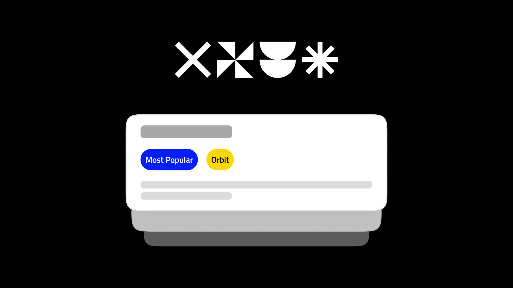

Badges are small, visual elements that clearly and concisely communicate status, achievement, or information. They supplement other UI components, adding meaning at a glance.

-----
## Overview
### Types

- **Notification badges**
    - Use a circle or rectangle notification badge to notify, quantify, or indicate a role or status.
- **Status badges**
    - Use a simple shape to indicate newness or current status.

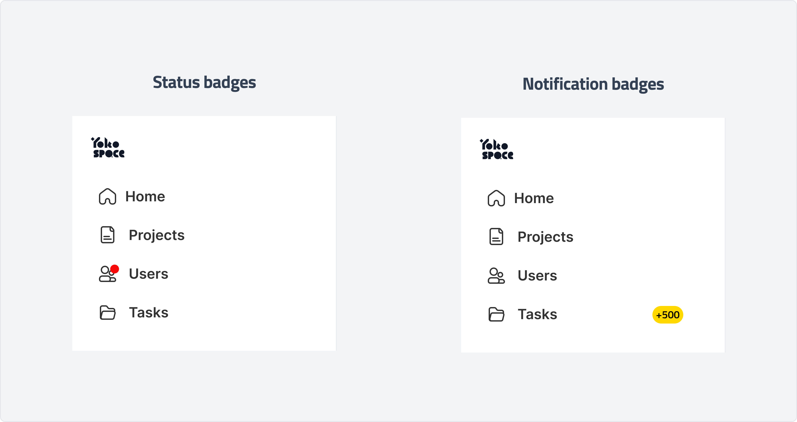

### Anatomy

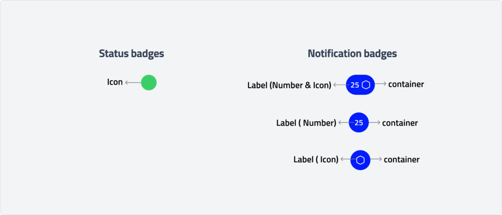 

### Usage

#### Notification badges

Use a circle or rectangle notification badge to notify, quantify, or indicate a role or status.

*   Notify users of new content within an entry point.
*   Quantify the number of items, including item quantity or applied filters.
*   Indicate the role or status of an item, such as verified or unverified.

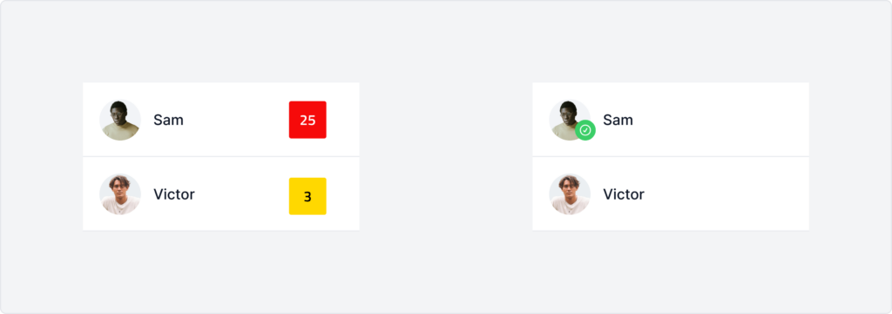

#### Status badges

Use a simple shape to indicate newness or current status

*   Indicate new updates, such as activity feed or change log entries.
*   Indicate item status, such as read or unread messages.
*   Indicate item type, such as a chart.

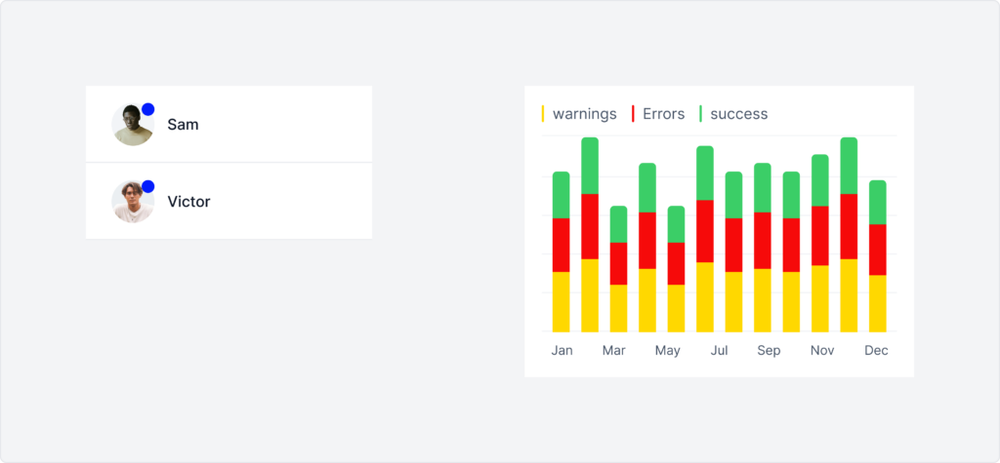

### Behaviour

- #### Rectangle Badge
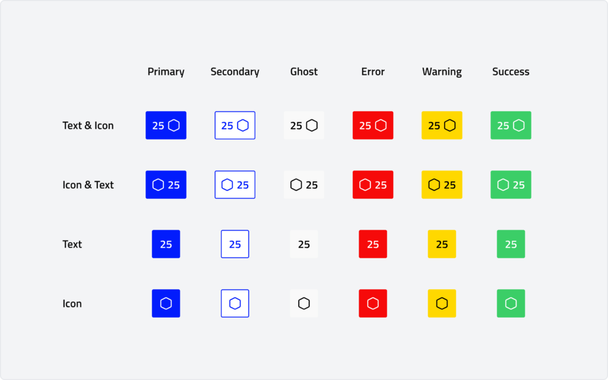

- #### Circle Badge
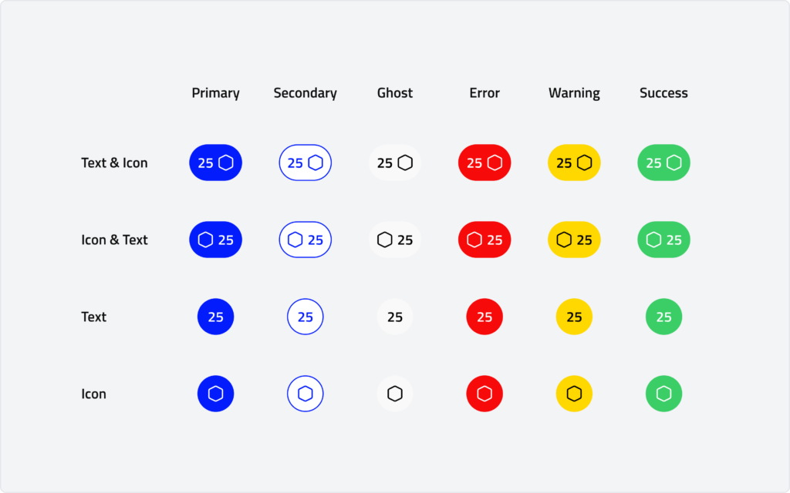

- #### Status Badge
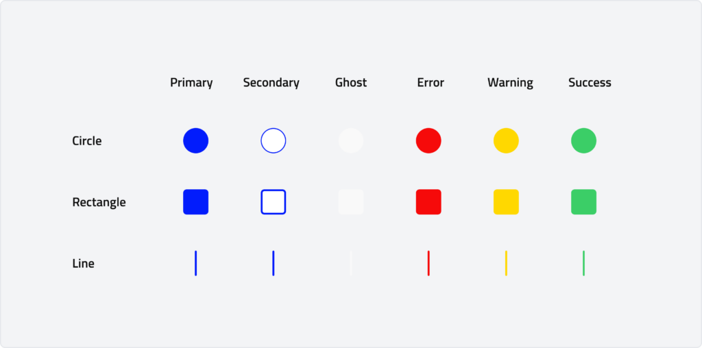

## Specs
### Measurements

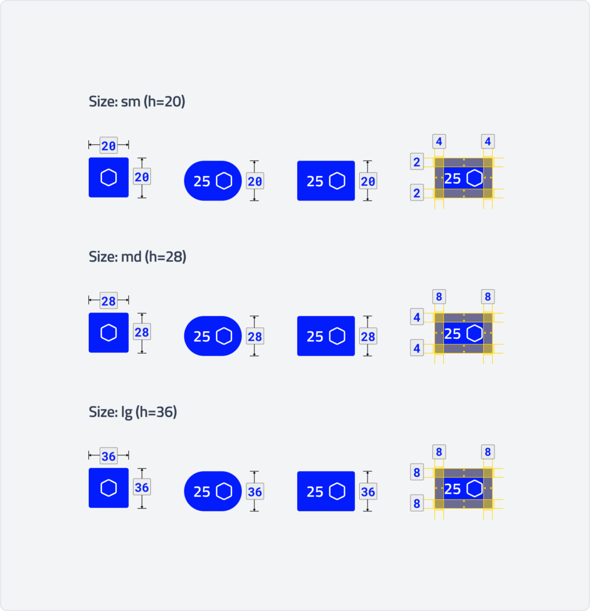

| Name| Value |
| --- | --- |
| Small badge size    | 20 dp |
| Small badge icon.   | 12 dp |
| Medium badge size   | 20 dp |
| Medium badge icon   | 16 dp |
| Large badge size    | 36 db |
| Large badge icon    | 20 dp |

### Position

Badges can be positioned absolutely to overlay assets or inline to occupy layout space.

Avoid badge overlaps with trailing elements. Instead, place badges at the lockup’s end or use smaller badges.

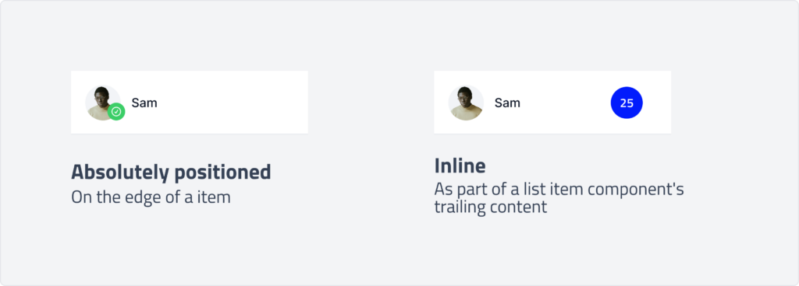

### width

Badges are not fixed-width; therefore, their containers should not be stretched to fill the layout

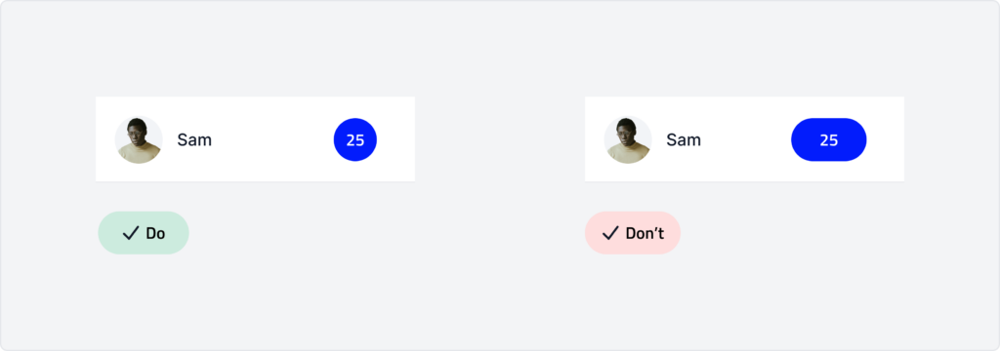

### Label Text

Label notification badges with a count or status. Badge labels can contain up to four characters, including a ‘+’ for overflow.

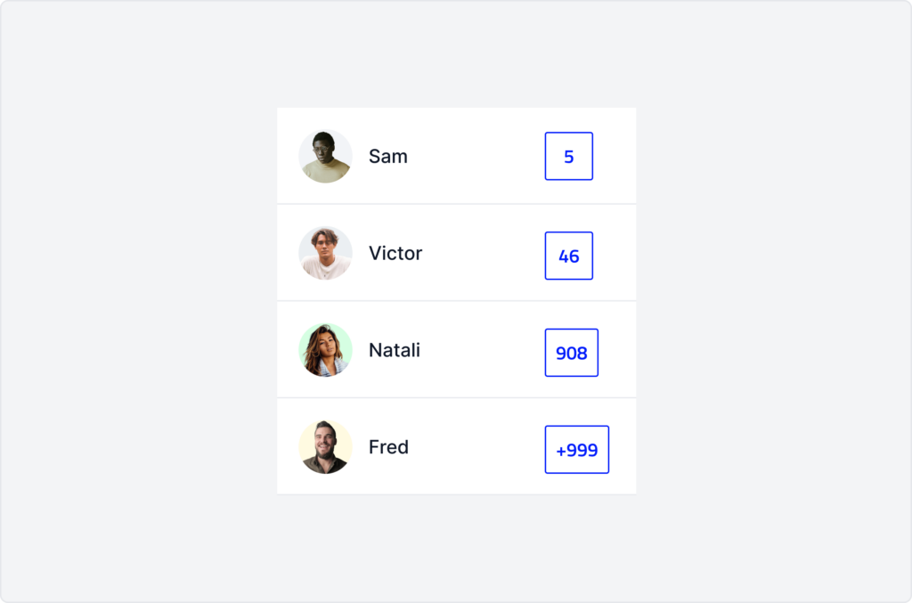

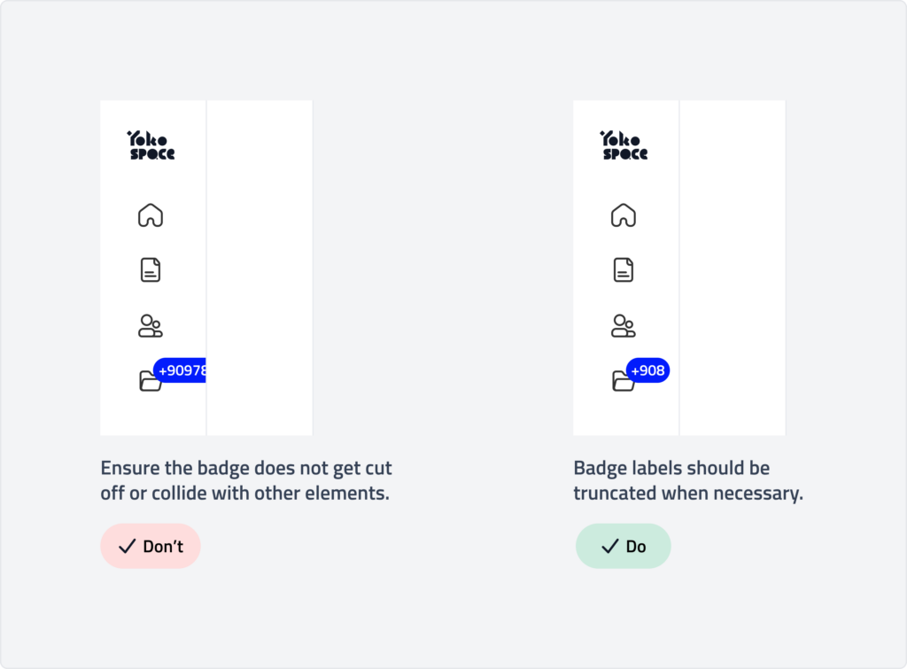

