import Tabs from '@theme/Tabs';
import TabItem from '@theme/TabItem';

# Button
A button is a primary interactive element that triggers an action or event. It guides user interaction by providing clear affordances for clickable actions

---
## Overview
### Types

-   #### Fill
    - A button with a solid background color, providing maximum visual emphasis for primary actions.
-   #### Outline
    - A button with a border and a transparent background, offering a balanced, secondary-level emphasis.
-   #### Ghost
    - A minimalist button with no background or border, ideal for subtle actions or less critical interactions.

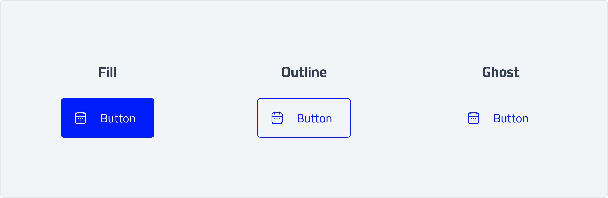

### Style

-   #### Primary
    - Emphasizes the most important action on a screen using a strong, prominent color to ensure visibility.
-   #### Secondary
    - Offers a less visually dominant style for supporting actions, providing an alternative to the primary button.
-   #### Error
    - Used for critical or destructive actions, employing alert colors to highlight potential consequences and draw user attention.

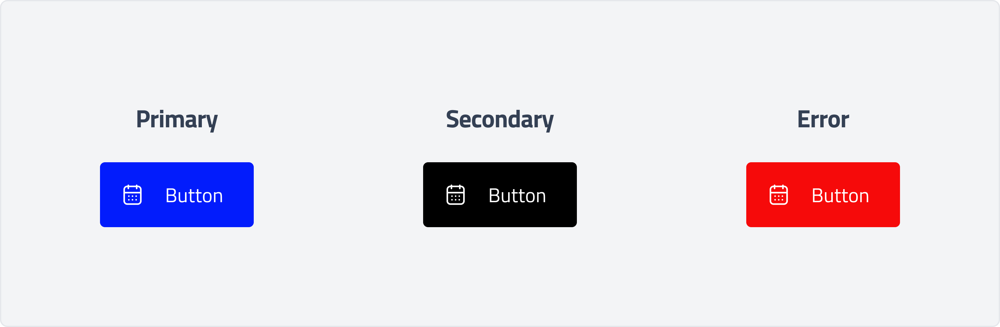

### Anatomy

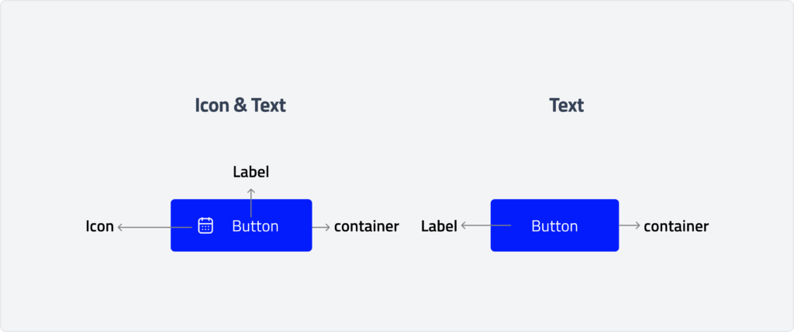
### Usage

#### Hierarchy

Button Hierarchy refers to the design principle of organizing buttons within a user interface (UI) to create a clear distinction between different levels of importance, guiding users to take desired actions effectively. Establishing button hierarchy improves usability, reduces decision fatigue, and enhances the overall user experience.Establishing
Each screen should contain a single prominent button for the primary action, using the strongest emphasis to command the most attention. Buttons rely on color and contrast to establish a clear hierarchy: primary buttons have the highest emphasis, followed by secondary . The arrangement of on-screen elements should visually reinforce the relative importance of each action.

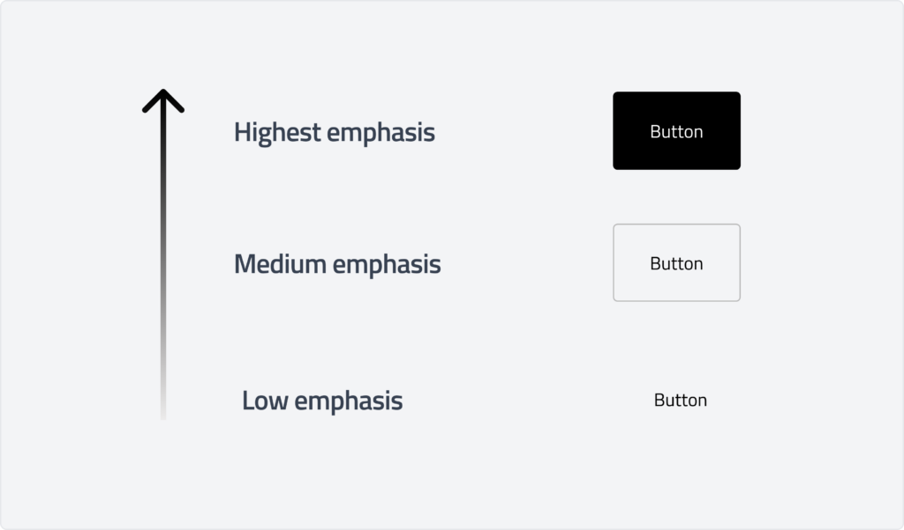

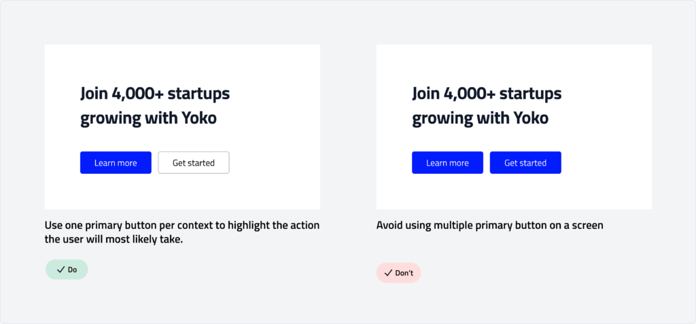

### Primary Button

Primary buttons provide the highest level of emphasis within a layout. They should be reserved for the most significant action on a screen, such as "Continue," "Submit," or "Confirm."

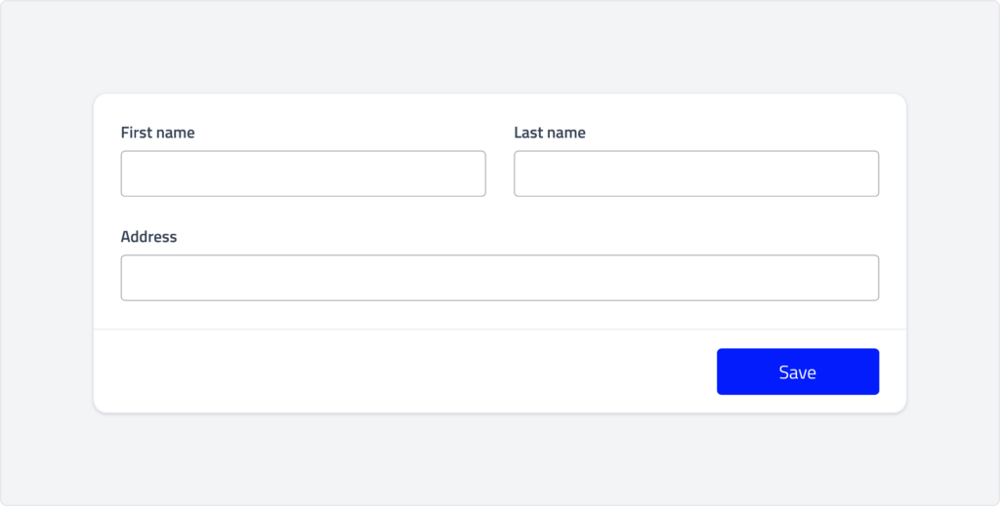

### Outline Button

Outlined buttons are medium-emphasis buttons used for secondary actions that are important but not primary. They balance visibility with subtlety, making them ideal for supporting choices without overwhelming the user interface.

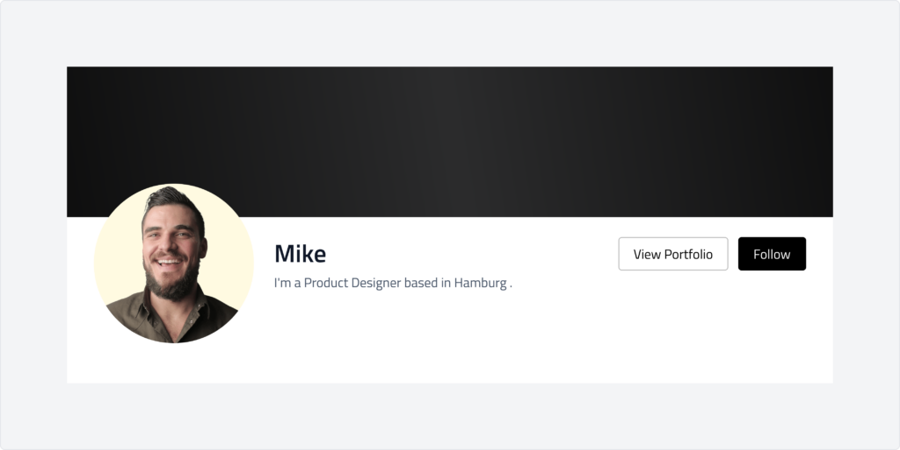

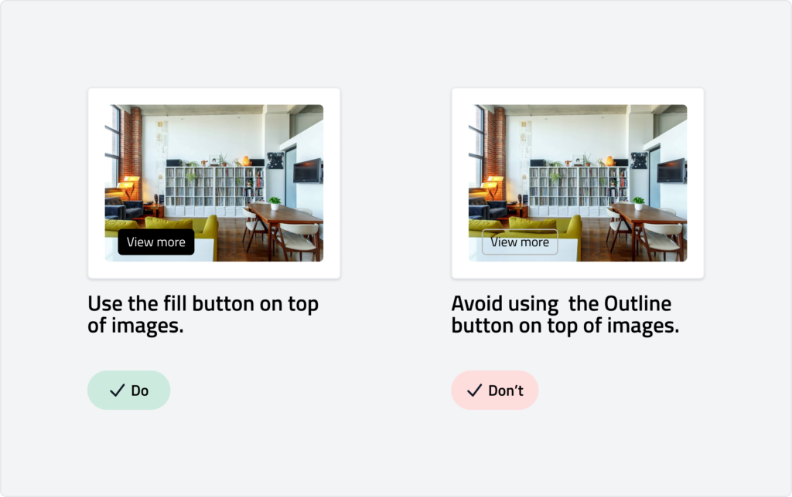

### Ghost Button

Ghost buttons are low-emphasis buttons designed for secondary or tertiary actions. They are ideal when space is limited or when presenting multiple options without overwhelming the interface.

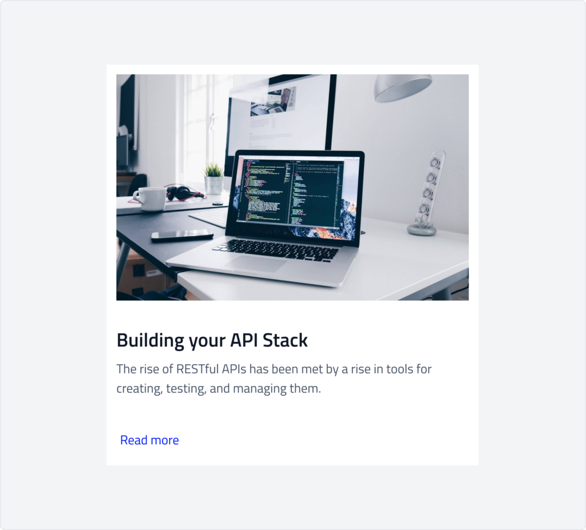

### Behaviour

#### Primary
<Tabs>
    <TabItem value="default" label="default" default>
        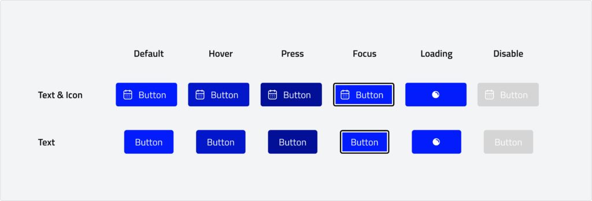

    </TabItem>
    <TabItem value="outline" label="outline">
        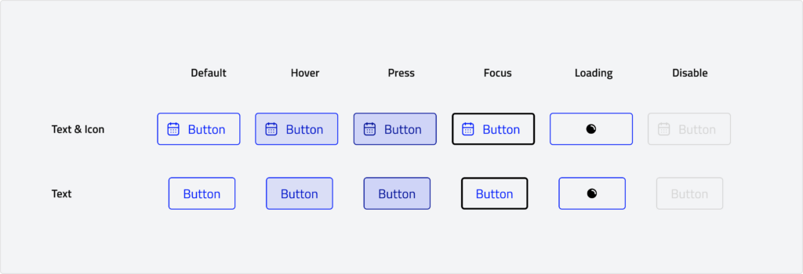
    </TabItem>
    <TabItem value="ghost" label="ghost">
        
    </TabItem>

</Tabs>

#### Secondary
<Tabs>
    <TabItem value="default" label="default" default>
       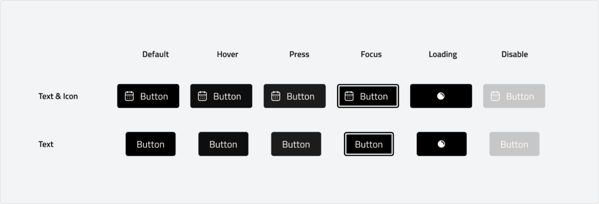
    </TabItem>
    <TabItem value="outline" label="outline">
        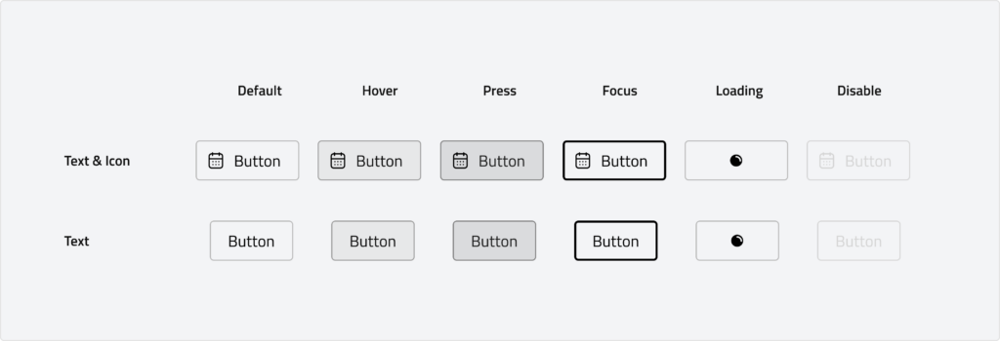
    </TabItem>
    <TabItem value="ghost" label="ghost">
        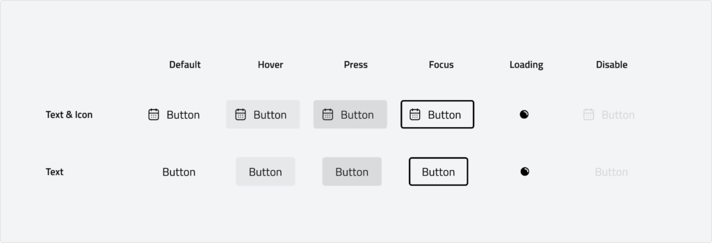
    </TabItem>
</Tabs>

#### Error
<Tabs>
    <TabItem value="default" label="default" default>
       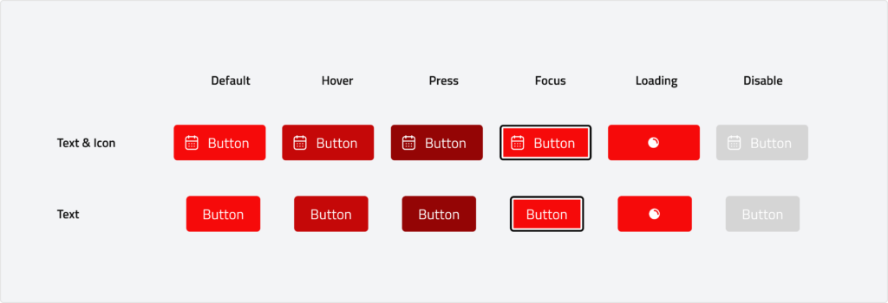
    </TabItem>
    <TabItem value="outline" label="outline">
        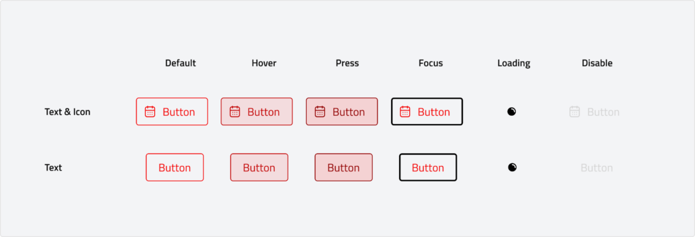
    </TabItem>
    <TabItem value="ghost" label="ghost">
        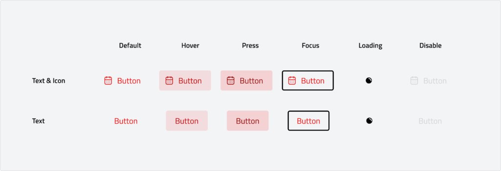
    </TabItem>
</Tabs>

## Specs

### Measurements

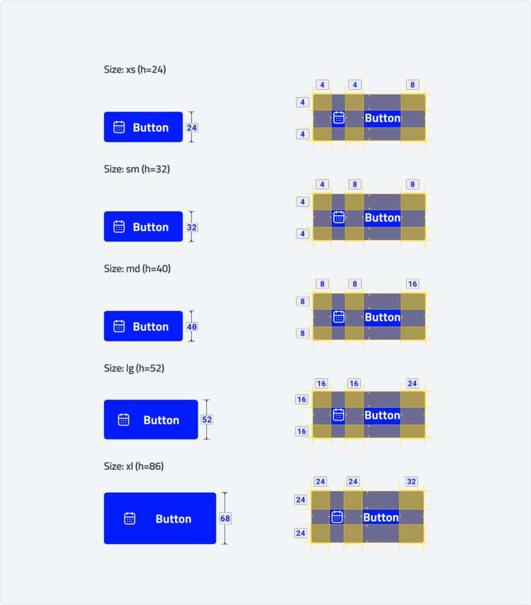

| Attribute | Value |
| :--- | --- |
| Container height xs | 24 dp |
| Icon size (xs) | 16 dp |
| Container height sm | 32 dp |
| Icon size (sm) | 20 dp |
| Container height md | 40 dp |
| Icon size (md) | 20 dp |
| Container height lg | 52 dp |
| Icon size (lg) | 20 dp |
| Container height xl | 68 dp |
| Icon size (xl) | 20 dp |
| Container corner shape | 4 dp |

### Button Label

Button labels indicate what happens when the user taps the button

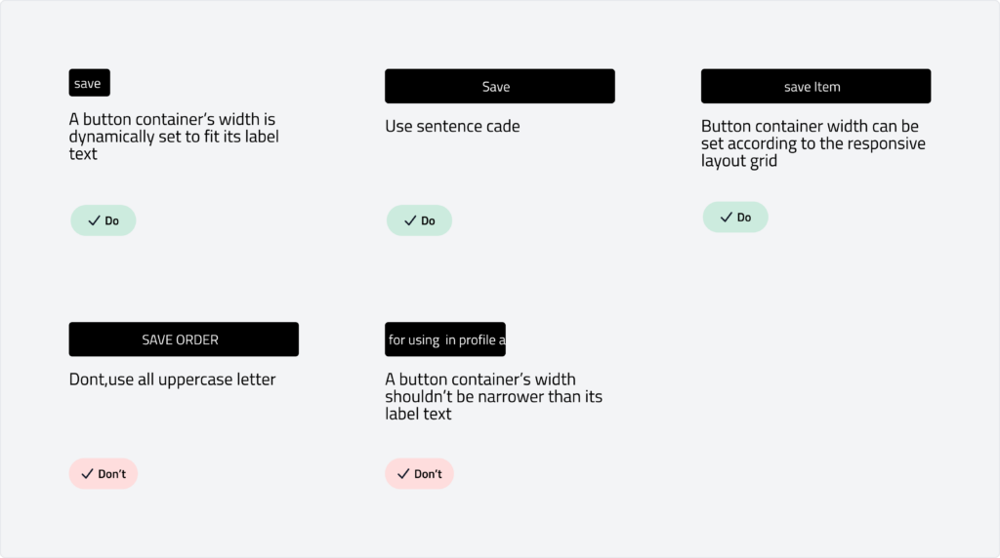