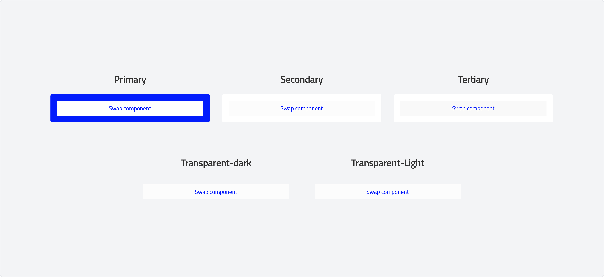
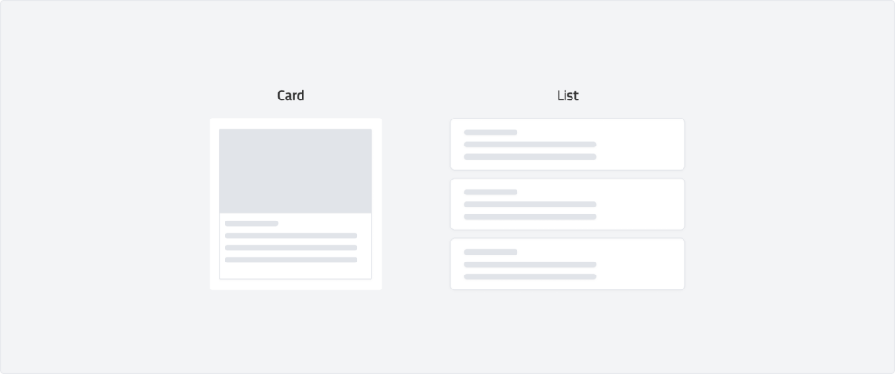
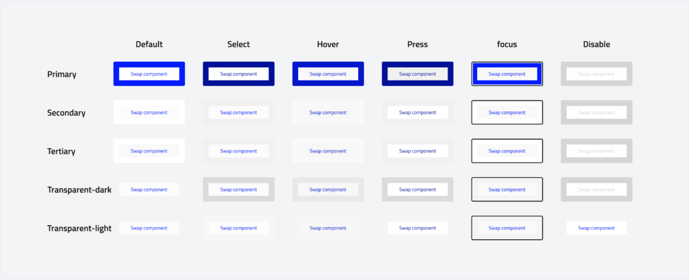

import Tabs from '@theme/Tabs';
import TabItem from '@theme/TabItem';

# Card
A card is a flexible container that holds information and actions related to a single concept or object. In our design system, cards are highly customizable, allowing designers to swap any element within them to fit different use cases. This adaptability ensures consistency while providing the freedom to structure content dynamically, making cards suitable for a wide range of applications.

## Overview
### Styles
-   **Primary:** The most prominent card style, used to highlight key content. It typically has a distinct background and strong visual hierarchy, making it ideal for main content areas or critical information.
-   **Secondary:** A more subdued card compared to the primary style, used for supporting content. It maintains clear visibility while being less dominant, ensuring a balanced layout.
-   **Tertiary:** A minimal card style with less emphasis, often used for supplementary information. It blends well with the background while maintaining structure, making it useful for less critical content.
-   **Transparent-Dark:** A card with a dark, semi-transparent background, designed for overlaying on images or dark-themed interfaces. It ensures readability while maintaining a sleek, modern aesthetic.
-   **Transparent-Light:** A light, semi-transparent card, ideal for overlaying on light backgrounds. It provides structure without being too visually heavy, making it useful for subtle UI elements.

### Anatomy

### Usage

Use a card to present related information on a single topic. Cards can act as previews, guiding users to a deeper experience or serving as standalone content.

**Card vs. List Item**

Cards evolved from skeuomorphic design, resembling physical playing cards. Over time, their visual cues---like containers and shadows---have become less necessary for recognition. While cards and list items may share similarities, they serve different purposes.

#### List Items:

-   Typically display information in a row, making it easy to scan labels, icons, or controls.
-   Stacked vertically for efficiency, taking up less space than cards.
-   Ideal for search results, settings, and compact content layouts.

#### Cards:

-   Occupy more space, making them better suited for displaying rich content.
-   Support dynamic media like videos and tag clouds, while lists focus on text and simple visuals.
-   Can be arranged in grids, stacks, or scrollable layouts for flexible presentation.

### Behaviour

## Specs

### Measurements

| Attribute | Value |
| :--- | --- |
| Container corner shape | 4 dp |
| Left/right padding  | 16dp
