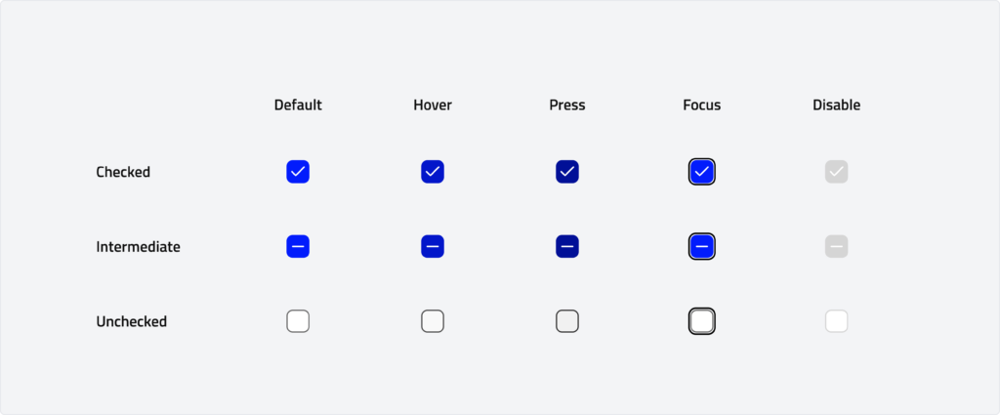

import Tabs from '@theme/Tabs';
import TabItem from '@theme/TabItem';

# Checkbox
Checkboxes are interactive elements that allow users to select one or multiple options from a set. They are typically used for binary choices, such as turning settings on or off or selecting multiple items in a list.
## Overview
### Types

-   **Checked:** A checkbox is marked with a checkmark to indicate that an option or setting is selected or enabled.
-   **Unchecked:** A checkbox appears empty to indicate that an option or setting is not selected or disabled.
-   **Indeterminate:** A checkbox is partially filled (e.g., a horizontal line) to represent a mixed state where some, but not all, options within a group are selected.

### Anatomy

### Usage
Use a checkbox when users need to select one or multiple options from a list or toggle a specific option on or off. Checkboxes can also stand alone to represent a single binary choice.

**Checkboxes are commonly used for:**

-   Selecting items in lists or tables
-   Agreeing to terms and conditions
-   Completing forms and surveys

**When deciding between a checkbox, a toggle switch and radio button :**

-   Choose a checkbox when the action requires confirmation with a final button (e.g., "Submit" or "Save").
-   Choose a toggle switch for actions that take immediate effect (e.g., enabling notifications or dark mode).
-   Choose a radio button when you need users to select a single option from a list of mutually exclusive choices (e.g., choosing a payment method or selecting a shipping option).

### Indeterminate State

When a checkbox controls a group of related options, selecting or clearing the parent checkbox will select or clear all of the child options. The indeterminate state indicates when some, but not all, of the child options are selected.\
To improve clarity, create a visual distinction between parent and child checkboxes. This can be done by indenting the child checkboxes, making it easier for users to understand which options will be affected when the parent checkbox is selected or cleared.

### Behaviour

## Specs
### Measurements

| Attribute | Value |
| --- | --- |
| Container | 16 dp |
| Container corner shape | 4 dp |
| Icon size | 12 dp |
| Icon alignment | Center |
| Target size | 24 db |

### Checkbox Label

We recommend keeping checkbox labels under three words for clarity and brevity. If space is limited, try rephrasing the label rather than truncating it with an ellipsis. For longer labels, it's better to allow the text to wrap onto a second line rather than cutting it off. The label text should be aligned beneath the checkbox to ensure proper alignment with the control, providing a clean and consistent appearance.

### Label Alignment

Checkbox labels are typically placed to the right of the checkbox input. In cases where checkboxes are grouped together, they can be arranged either vertically or horizontally, depending on the specific use case and layout of the interface. For better readability and a more organized structure, it's recommended to align checkbox and radio button groups vertically whenever possible. This layout improves scalability and user experience.

