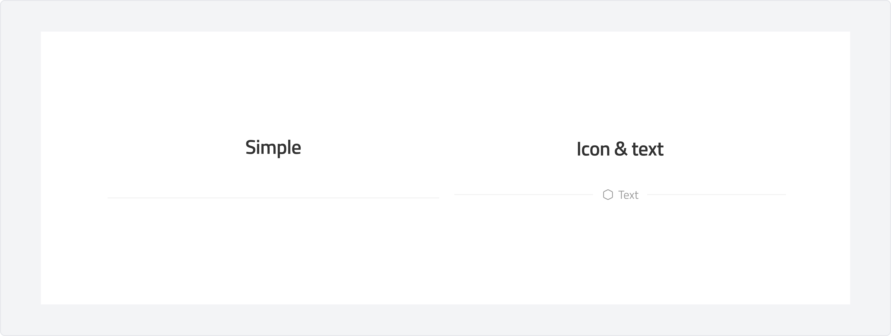
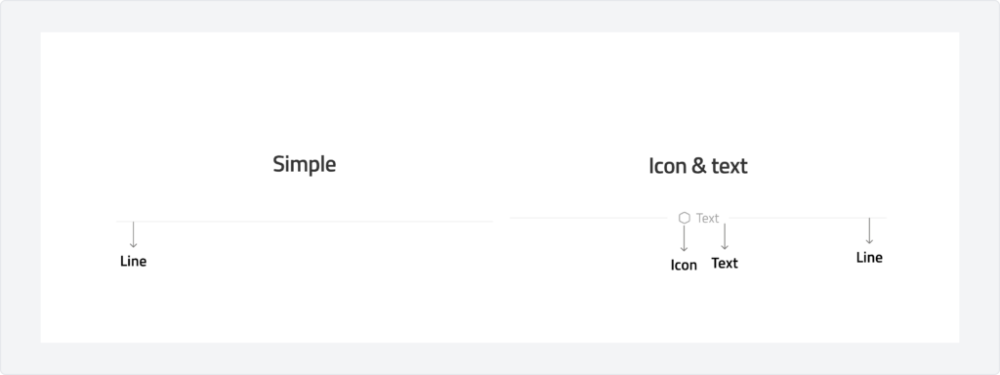
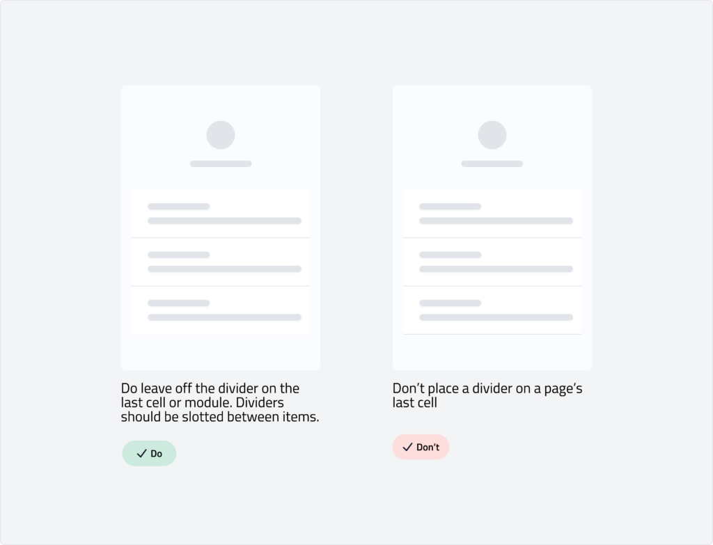

# Divider
A divider is a visual element that separates content into distinct sections, improving readability and organization. It helps create clear groupings within a layout without adding unnecessary visual weight.

---

## Overview
### Types

-  **Simple:** A minimal line that separates content cleanly without distractions.
-   **Divider with Icon or Text:** A divider that includes an icon or label to provide additional context, such as section headings or category labels.(you can set contentment center,left and right)

### Anatomy

### Usage

Use a divider to create clear visual separation between related or distinct content areas. Dividers help improve readability and organization by structuring information without adding unnecessary complexity.

**Use Cases:**

-   **Separating Sections:** Divide content into meaningful sections within a page or layout.
-   **Grouping Related Items:** Use within lists, menus, or cards to distinguish related content.
-   **Contextual Labels:** When using a divider with text or an icon, provide context for grouped elements, such as categories in a settings panel or filters in a sidebar.

## Specs
### Measurements

| Attribute | Value |
| :--- | --- |
| Container | 16 dp |
| Container corner shape | 4 dp |
| Icon size | 12 dp |
| Icon alignment | Center |
| Target size | 24 db |
