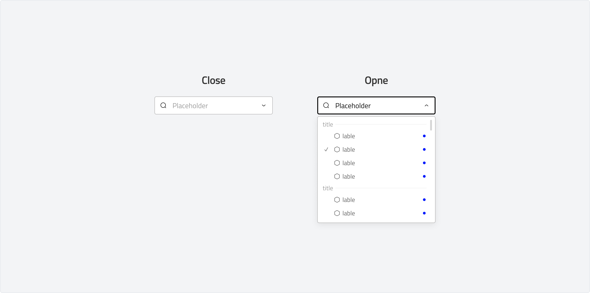
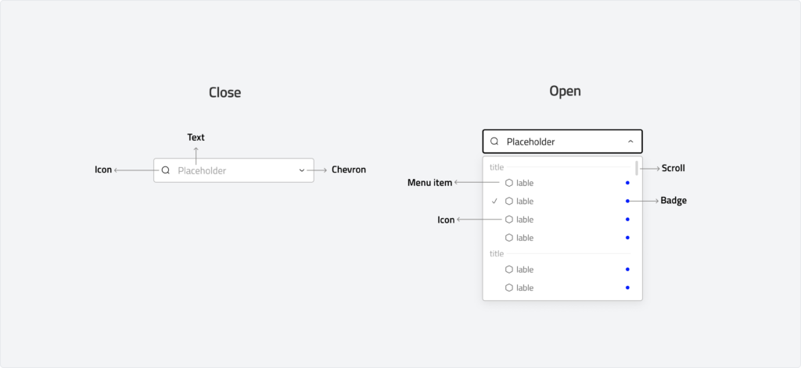
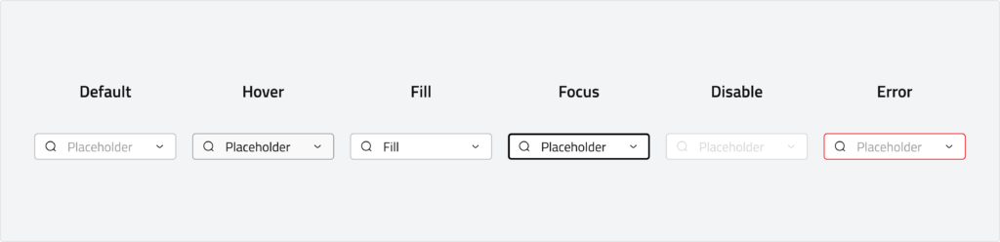
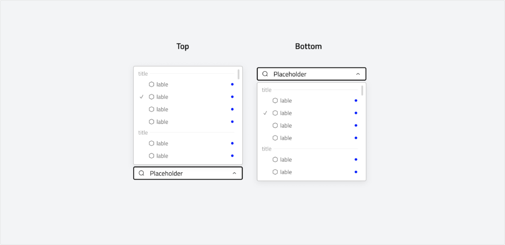
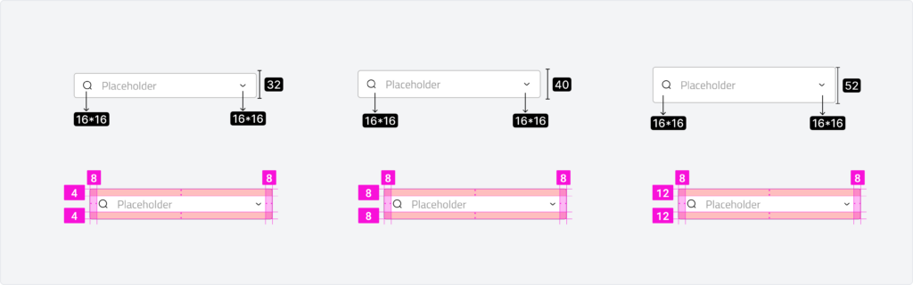

import Tabs from '@theme/Tabs';
import TabItem from '@theme/TabItem';

# Drop-down
A dropdown is a component that allows users to select an option from a list. It provides a compact way to present multiple choices while keeping the interface clean.

---

## Overview
### State

-   **Close:** In the closed state, we support interactive states such as hover, press, and focus
-   **Open:** In the opened, the dropdown reveals a menu containing selectable options(Our dropdowns utilize the **menu component** for displaying options, ensuring consistency in behavior and appearance.)

### Anatomy

### Usage

Use a dropdown to present a list of options in a compact and efficient way. Dropdowns help streamline interfaces by hiding options until they are needed, reducing clutter and improving usability.

Use case

-   Selecting a single option from multiple choices (e.g., choosing a country, language, or category).
-   Providing a list of actions in a menu (e.g., profile settings, logout).
-   Filtering content dynamically (e.g., sorting items in a list).

### Behaviour

<Tabs>
    <TabItem value="Close" label="default" default>
       
    </TabItem>
    <TabItem value="Open" label="outline">
        
    </TabItem>
</Tabs>

## Specs
### Measurements

| Attribute | Value |
| :--- | --- |
| Container | 32,40,52 dp |
| Container corner shape | 4 dp |
| Icon size | 16 dp |
| Padding | 4*8 (32) , 8*8(40) , (12*8) 52 |