import Tabs from '@theme/Tabs';
import TabItem from '@theme/TabItem';

# Icon Button
Icon buttons are compact buttons that display icons without accompanying text labels. They are used for actions where the icon alone clearly communicates the function, such as navigation, closing a dialog, or sharing content.
## Overview
### Types

-   **Fill:** A icon button with a solid background color, providing maximum visual emphasis for primary actions.
-   **Outline:** A icon button with a border and a transparent background, offering a balanced, secondary-level emphasis.
-   **Ghost:** A icon button with no background or border, ideal for subtle actions or less critical interactions.

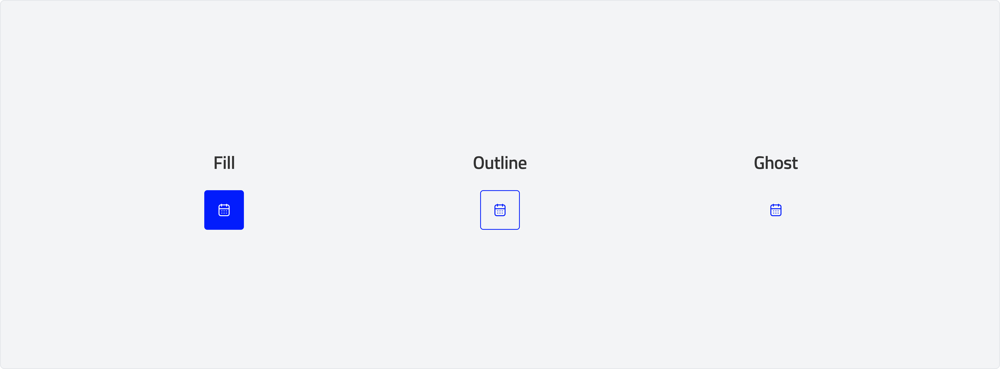

### Style

-   **Primary:** A style used to highlight the most important action on a screen, typically with a strong, prominent color.
-   **Secondary:** A style for supporting actions, offering a less visually dominant alternative to the primary button.
-   **Error:** A style indicating critical or destructive actions, using alert colors to draw user attention to potential consequences.

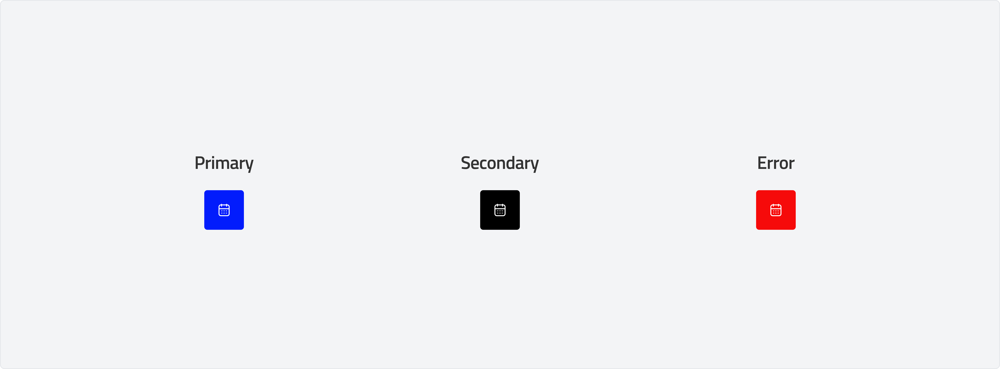

### Anatomy

### Usage

Use icon buttons to display actions in a compact layout. 

**Hierarchy**

Button Hierarchy refers to the design principle of organizing buttons within a user interface (UI) to create a clear distinction between different levels of importance, guiding users to take desired actions effectively. Establishing button hierarchy improves usability, reduces decision fatigue, and enhances the overall user experience.
Each screen should contain a single prominent button for the primary action, using the strongest emphasis to command the most attention. Buttons rely on color and contrast to establish a clear hierarchy: primary buttons have the highest emphasis, followed by secondary . The arrangement of on-screen elements should visually reinforce the relative importance of each action.

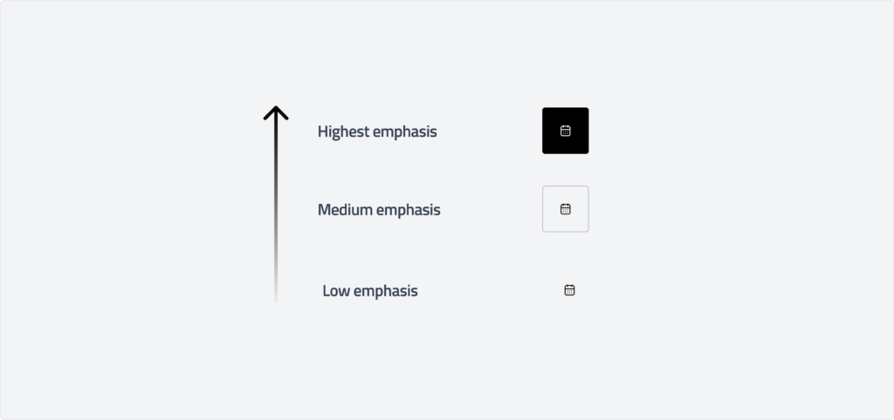
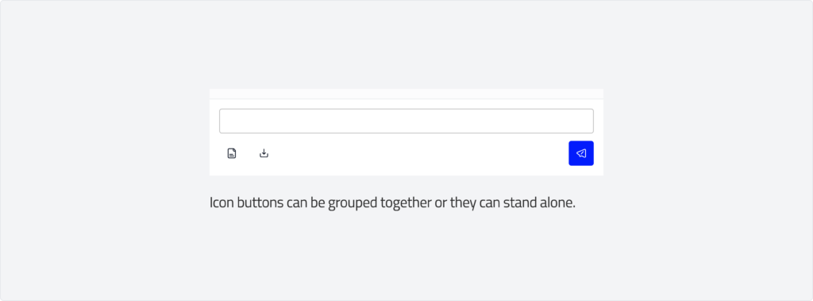

**Fill Button:** Use filled icon buttons for prominent actions, such as Sending message .

**Outline Button:** Use outlined icon buttons for secondary actions, such as muting notifications or marking a message as unread.

**Ghost Button:** Use ghost icon buttons for low emphasis actions, such as expanding additional options or refreshing content.

### Behaviour
#### Primary
<Tabs>
    <TabItem value="default" label="default" default>
        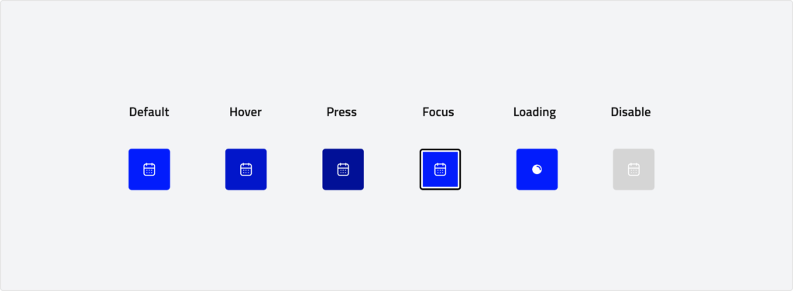
    </TabItem>
    <TabItem value="outline" label="outline">
        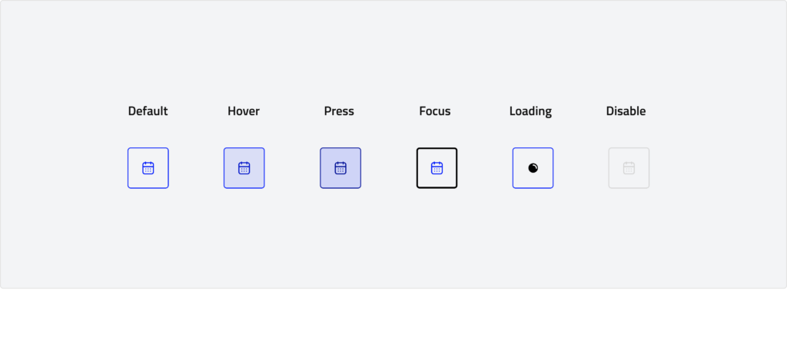
    </TabItem>
    <TabItem value="ghost" label="ghost">
        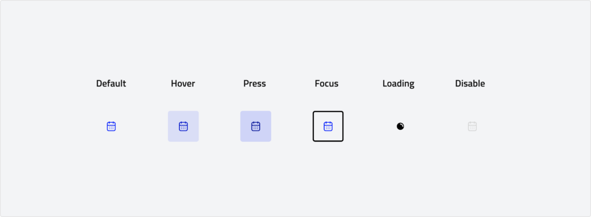
    </TabItem>

</Tabs>

#### Secondary
<Tabs>
    <TabItem value="default" label="default" default>
       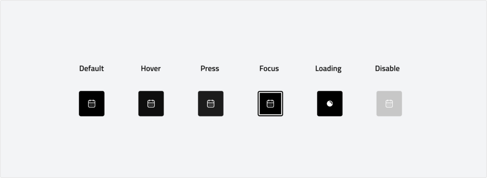
    </TabItem>
    <TabItem value="outline" label="outline">
        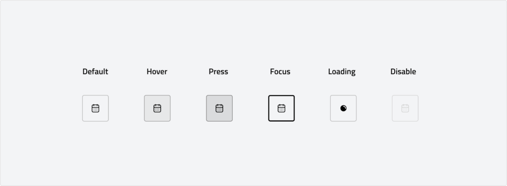
    </TabItem>
    <TabItem value="ghost" label="ghost">
        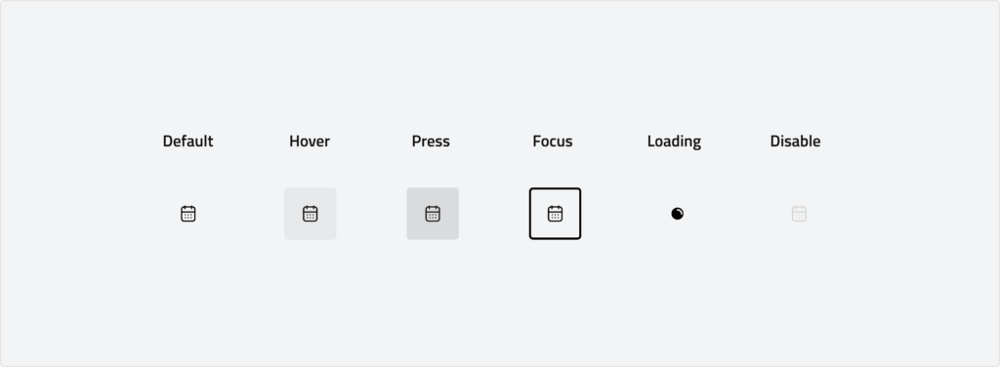
    </TabItem>
</Tabs>

#### Error
<Tabs>
    <TabItem value="default" label="default" default>
       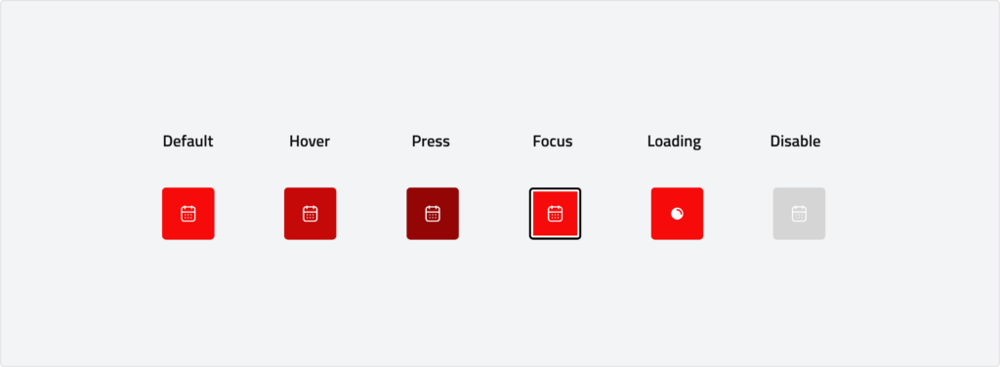
    </TabItem>
    <TabItem value="outline" label="outline">
        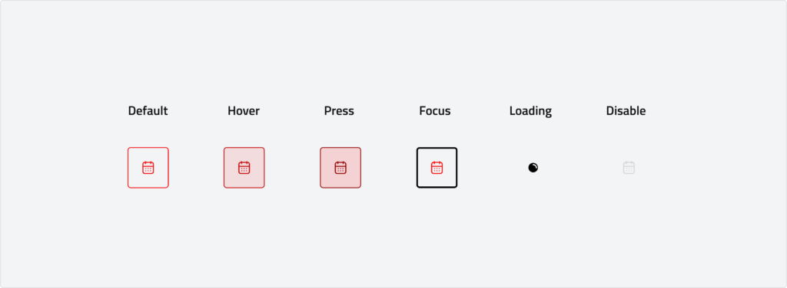
    </TabItem>
    <TabItem value="ghost" label="ghost">
        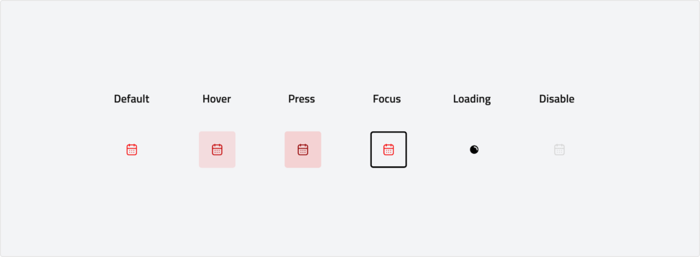
    </TabItem>
</Tabs>