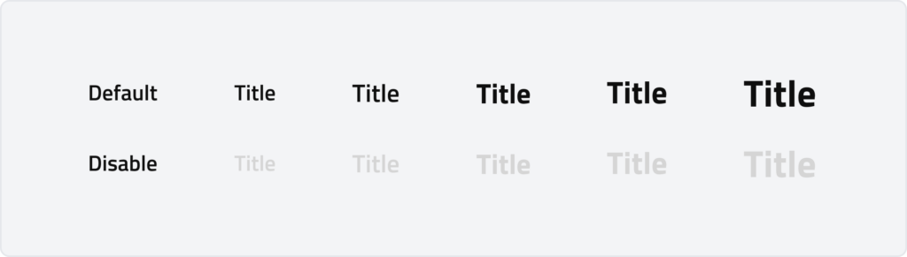

# Label
Labels provide context and categorization to interface elements. They can be used independently to organize content or paired with components like checkboxes and dropdowns to clarify their purpose.

Labels help users navigate and understand information at a glance. When labeling form components, use an asterisk to indicate required fields, ensuring clarity in data input.

---

## Overview

### Content
Labels should clearly and concisely describe the required information, typically using a short phrase. When necessary, a question format can be used, but full sentences or instructional text should be avoided. Use sentence-style capitalization, where only the first word is capitalized.

### Behaviour
