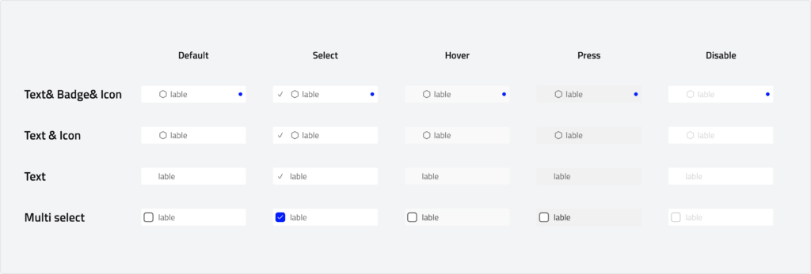

# Menu
A menu is a list of actions or options presented to the user, typically triggered by interacting with a button, icon, or another UI element. It helps users navigate, make selections, or perform tasks efficiently.

Menus can appear as dropdowns, context menus, or navigation lists, adapting to different interaction patterns. In our design system, a menu is used within a dropdown component and supports various states, including hover, press, and disabled.

---

## Overview

### Types

-   **Single Select: **A single-select menu allows users to choose only one option from a list.This type of menu is ideal for cases where only one choice is needed, such as selecting a filter, choosing a category, or setting a preference.
-   **Multi Select: **A multi-select menu enables users to choose multiple options from a list without affecting previous selections. It is useful for scenarios where users need to apply multiple filters, select tags, or make bulk actions. Selections are usually indicated with checkmarks or other visual cues to show chosen items.

### Layout

#### Grouping
Organize menu options in a logical order, such as placing frequently used actions at the top and potentially destructive actions at the bottom. Group related options together to improve clarity and ease of selection.

### Anatomy

### Usage

Use a menu to present a list of options in a temporary pop-up, triggered by user interaction with an element like a button, icon, or input field.

Menus help users select from multiple choices while keeping the interface uncluttered. They are a more compact alternative to lists, radio buttons, or choice chips.

A menu should close automatically when an option is selected or when the user clicks outside of it. Ensure that menu options are clear and easy to scan, with logical grouping where necessary.

### Behaviour

## Specs

### Measurements

| Attribute | Value |
| :--- | --- |
| Corner radius | 4 dp |
| Left/right padding | 8 dp |
| Up/Down padding | 8 dp |
| List item height | 28 dp |
| Divider height | 20 db |
| Leading icon size | 16 db|