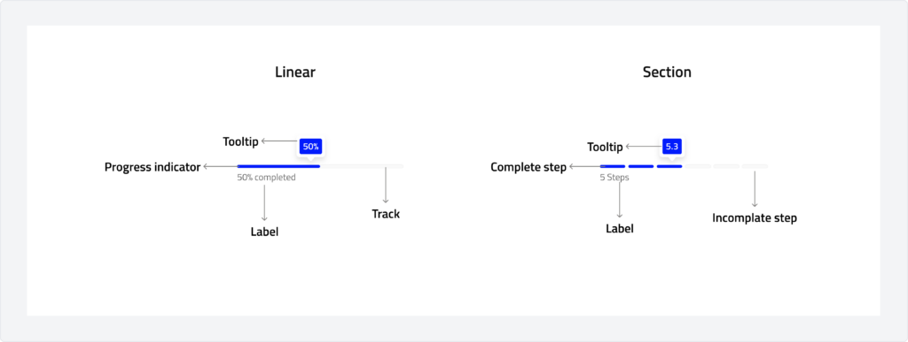
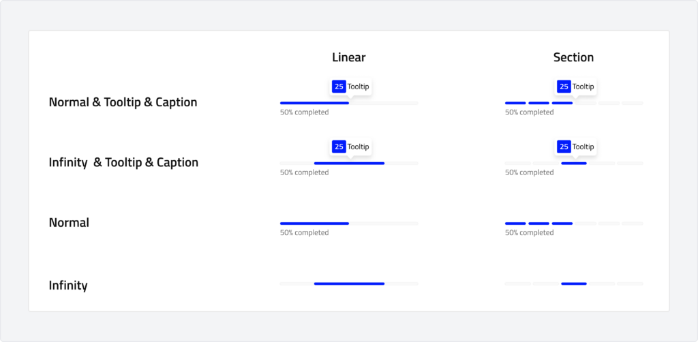

# Progress-bar
A progress bar is a visual indicator that represents the completion status of a task or process. It provides users with real-time feedback on ongoing actions, such as loading content, uploading files, or processing data.

---

## Overview

### Types

-   **Linear:** horizontal bar that visually represents the progress of a task from 0% to 100%. It can be **determinate**, showing a specific percentage of completion, or **indeterminate**, indicating an ongoing process with an unknown duration.
-   **Section:** A segmented bar that divides a process into multiple steps or sections. Each section represents a milestone, helping users track their progress in multi-step workflows or tasks. It provides a clearer sense of completion for structured processes.

### Anatomy

### Usage

Use a progress bar to visually indicate the completion status of a task or process. It helps users understand how much of a task has been completed and how much remains, providing transparency and reducing uncertainty.\
**Linear Progress Bar**:

-   To show completion in real-time for processes with a defined start and end point.
-   For tasks with a clear, measurable duration, such as file uploads, downloads, or installations.\
**Section Progress Bar**:

-   For tasks with a clear, measurable duration, such as file uploads, downloads, or installations.
-   To show completion in real-time for processes with a defined start and end point.

### Behaviour

