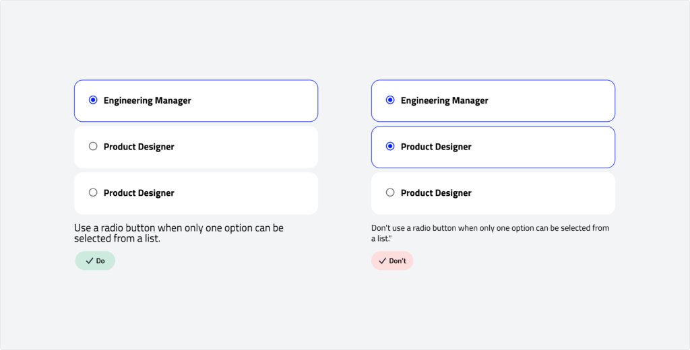
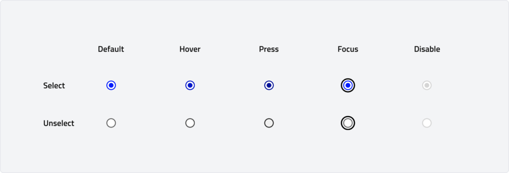
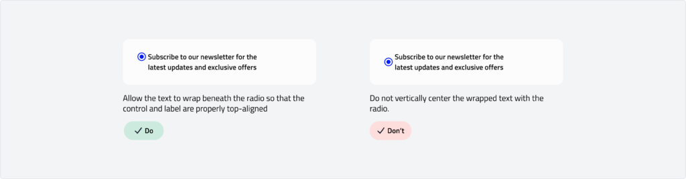

# Radio
Radio buttons are selection controls that allow users to choose a single option from a group of mutually exclusive choices. They are used when only one option can be selected at a time, such as selecting a payment method, choosing a delivery option, or specifying a user preference. Each radio button is accompanied by a label to clearly describe its purpose.

---

## Overview

### Types

-   **Select:** A selected radio button indicates that the associated option is currently chosen. It visually communicates the user's active choice in a group of mutually exclusive options.
-   **Unselect:** An unselected radio button shows that the associated option is not chosen. It provides users with the ability to select it if they wish to change their choice.

### Anatomy

### Usage

Use radio buttons when a user needs to select a single option from a list of mutually exclusive choices. Radio buttons ensure clarity by showing all available options at once, helping users make confident decisions.\
**Radio buttons are commonly used for:**

-   Selecting a payment method
-   Choosing a delivery option
-   Setting a user preference or configuration

**When deciding between radio buttons and other controls:**

-   Use radio buttons when only one option can be selected within a group.
-   Use checkboxes for multiple selections.
-   Use toggle switches for actions that take immediate effect

### Behaviour

## Specs
### Measurements

| Attribute | Value |
| --- | --- |
| Icon size | 16 dp |
| Target size | 24 dp |

### Radio Label

We recommend that the labels for radio buttons are less than three words.\
Wrap long labels to the second line. The text should wrap beneath the radio button so the control and the first line of the label are top aligned.

