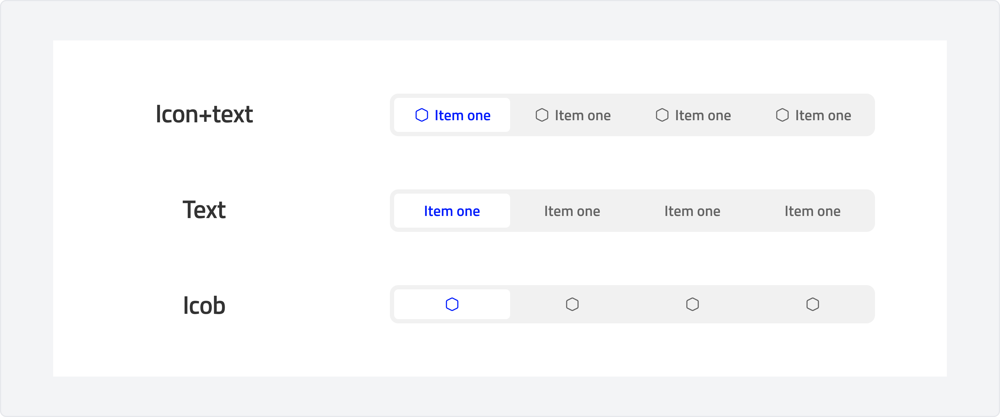
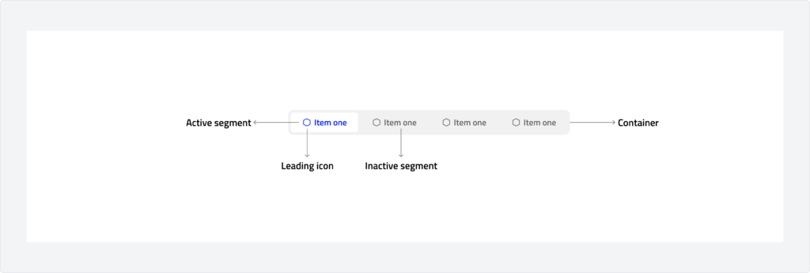
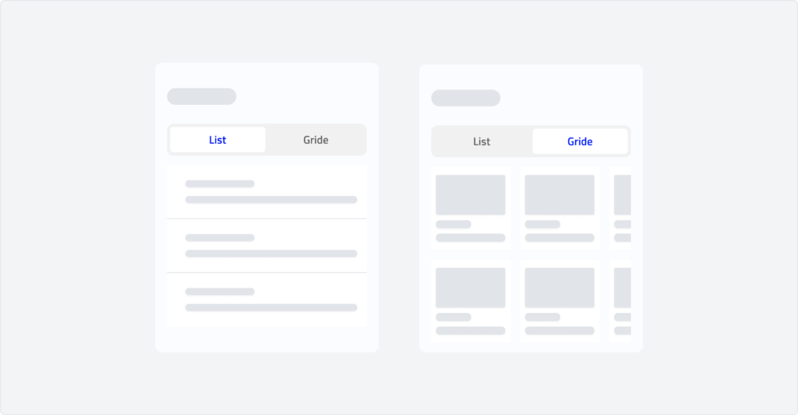
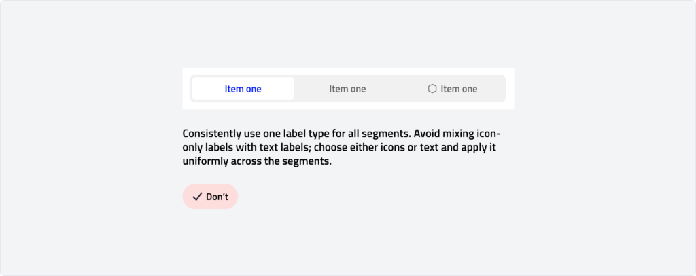
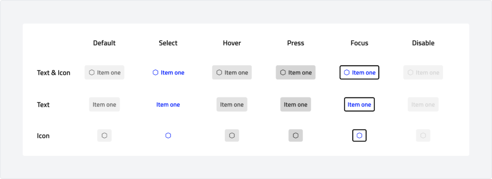
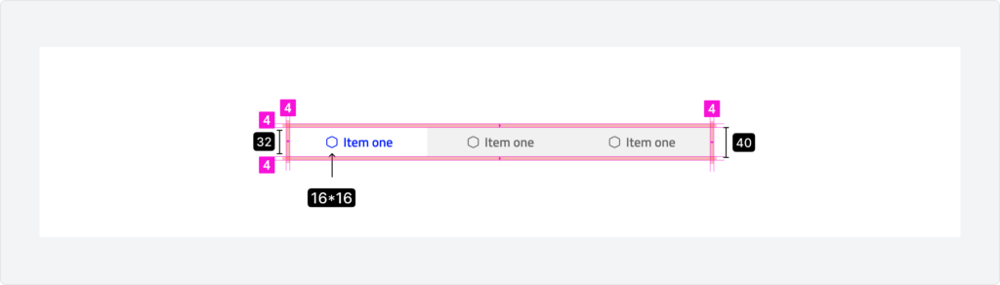

# Segment Control
A segment button or control is a UI element used to allow users to select one option from a predefined set of mutually exclusive choices, often presented in a horizontal layout. It is typically used when users need to toggle between a small number of options without overwhelming them with too many choices.
Segment buttons are visually grouped and allow for quick selection, where only one option can be selected at a time. This control provides a compact and clear way to represent exclusive choices such as filtering options or switching between modes, views, or settings.

---

## Overview

### Types

-   **Icon + text:** his type of segment control uses both an icon and accompanying text to represent each option. It provides a clear and visually appealing way to convey the option, especially when the icon helps to visually reinforce the meaning of the text. This type is useful for cases where the content is more complex and benefits from both a symbolic representation (icon) and a descriptive label (text).
-   **Icon:** he icon-only segment control relies solely on icons to represent the options. This style is more compact and minimalist, ideal for cases where the options are easily recognizable through their icons, providing a cleaner interface without unnecessary text.
-   **Text:** The text-only segment control uses plain text for each option, typically offering a clear, straightforward selection choice. This is ideal for cases where the options are simple and easily understood through text alone, without the need for icons.

### Anatomy

### Usage

#### Switch the presentation of a vie
Use a segmented control to toggle between different formats of the same content, making it easier for users to switch between different browsing experiences.

**Example Use Case:**
A segmented control can switch between a "Grid View" and a "List View" of products in an e-commerce app. This allows users to select the format that best suits their browsing preferences.

#### Browse within a view
Use a segmented control to navigate between different categories within the same view, especially when the content can be organized into distinct groups.

**Example Use Case:** A music streaming app can use a segmented control to toggle between categories such as "Songs," "Albums," and "Playlists," allowing users to easily navigate different types of music content within the same screen.

### Behaviour

## Specs

### Measurements

| Attribute | Value |
| :--- | --- |
| Container corner shape | 8 dp |
| Left/right padding | 4 dp |
| Select Segment | 32 dp |