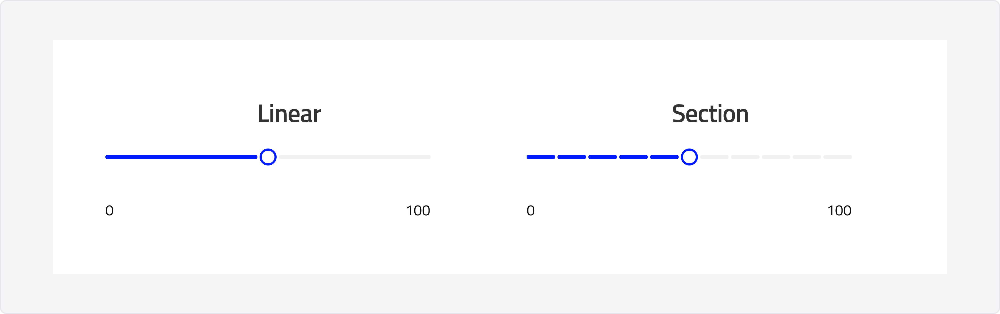
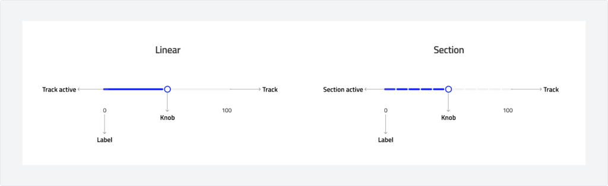
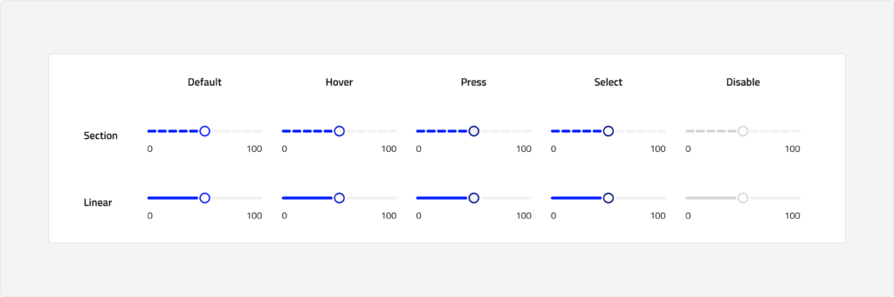

# Slider
A slider is a control that allows users to select a value from a range by sliding a handle along a track. It is commonly used for adjusting values such as volume, brightness, or any numerical input that fits within a predefined range.

---

## Overview

### Types

-   **Linear:** A linear slider allows users to select a value from a continuous range along a single axis, typically represented by a horizontal or vertical track. The user can drag the handle to any point on the track, adjusting the value fluidly within the specified range. Linear sliders are suitable for settings that require precise control over a range, such as volume or brightness adjustments.
-   **Section:** A section slider is a variation of the linear slider, but it is divided into distinct segments or sections, each representing a specific value or range. These sections allow users to select from predefined increments or categories within the total range. Section sliders are useful when users need to choose from a limited set of values, such as selecting a range of options or predefined intervals like low, medium, or high settings.

### Anatomy

### Usage

1- **Adjust continuous values:**
Use a slider when you want users to select a value from a continuous range. For example, adjusting volume, brightness, or speed. The user can pick any value along the track, making it suitable for fine-tuning settings.

2- **Select from predefined ranges (Section Slider):**
Use a section slider when you want to present users with distinct, predefined intervals. For example, selecting low, medium, or high options for a setting like energy consumption, difficulty level, or age group.

3- **Allow precise control:**
Sliders are useful when you want to give users the ability to adjust a setting with fine control but still want to provide clear constraints. For example, setting the price range on a marketplace or filtering items based on a value range (e.g., distance, price, or size).

4- **Visual representation of range:**
Sliders are great when the range of values should be visually represented, allowing users to quickly see the context of their selection, such as choosing a discount percentage or adjusting font size.

5- **Display and adjust settings:**
Sliders work well for both visual and functional changes. For example, a slider might change the layout of an interface or the level of a feature like transparency, blur effect, or filter intensity in real-time.

### Behaviour

