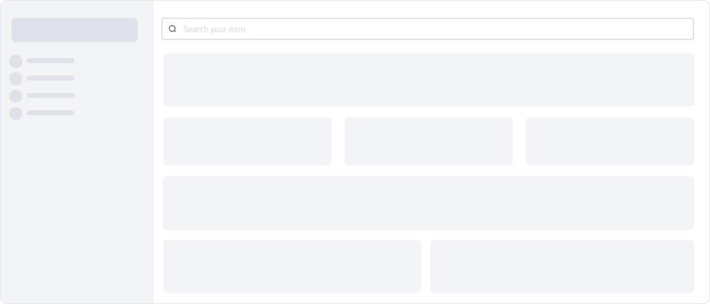
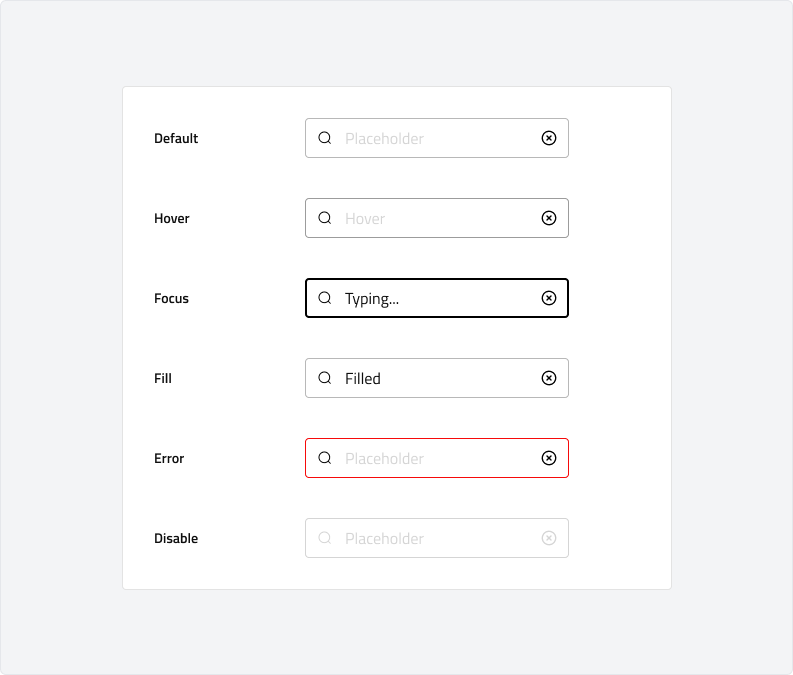

# Text input
A text input is a field that allows users to enter and edit text, such as names, emails, or search queries. It serves as a fundamental interaction element for collecting user input in forms, search bars, and other data entry interfaces.
Text inputs should be clear, accessible, and appropriately sized for their context. While they are highly flexible, maintaining consistency in their styling, behavior, and validation feedback ensures a smooth user experience across applications.

---

## Overview

### Anatomy

### Usage

Use an input field when users need to enter data, such as text, numbers, or passwords. Inputs are essential for forms, authentication, search, and other data entry tasks.\
Inputs are commonly used for:

-   Collecting user details (e.g., name, email, phone number)
-   Search queries and filters
-   Numeric entries, such as quantities or pricing
-   Password and authentication fields

Inputs should have clear labels to ensure accessibility and usability. However, in cases like search bars or compact UI designs, placeholders or icons may serve as implicit labels. If an input lacks a visible label, ensure its purpose remains clear through context or additional cues.

### Behaviour

