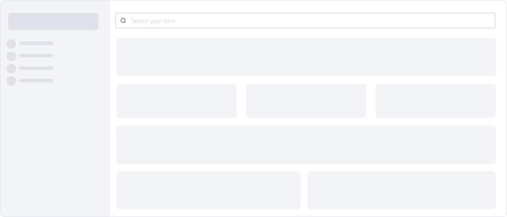
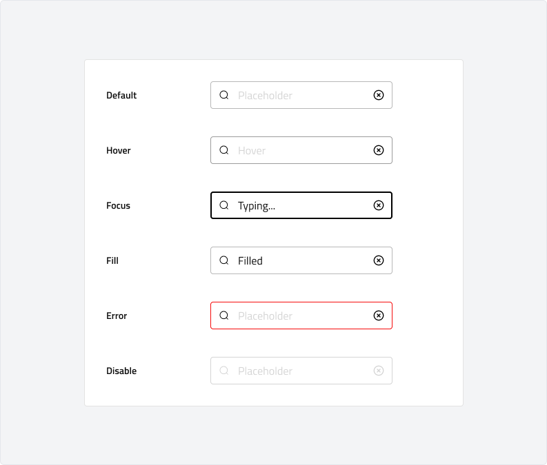

# Toast (Bug)
A toast is a lightweight, temporary notification that provides feedback on user actions, such as confirming a task or alerting users to system status. Toasts appear briefly on the screen and do not require user interaction to dismiss.
Toasts help keep users informed without interrupting their workflow. While they are versatile, it’s important to use them sparingly and ensure they are clear, concise, and contextually relevant to the action performed.

---

## Overview

### Anatomy

### Usage

Use an input field when users need to enter data, such as text, numbers, or passwords. Inputs are essential for forms, authentication, search, and other data entry tasks.\
Inputs are commonly used for:

-   Collecting user details (e.g., name, email, phone number)
-   Search queries and filters
-   Numeric entries, such as quantities or pricing
-   Password and authentication fields

Inputs should have clear labels to ensure accessibility and usability. However, in cases like search bars or compact UI designs, placeholders or icons may serve as implicit labels. If an input lacks a visible label, ensure its purpose remains clear through context or additional cues.

### Behaviour

