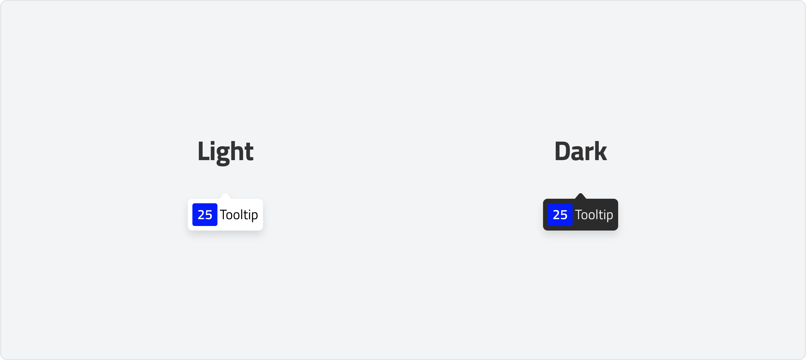
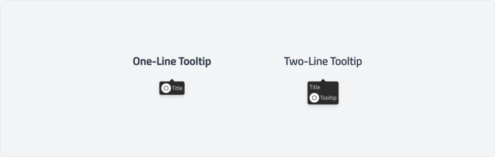
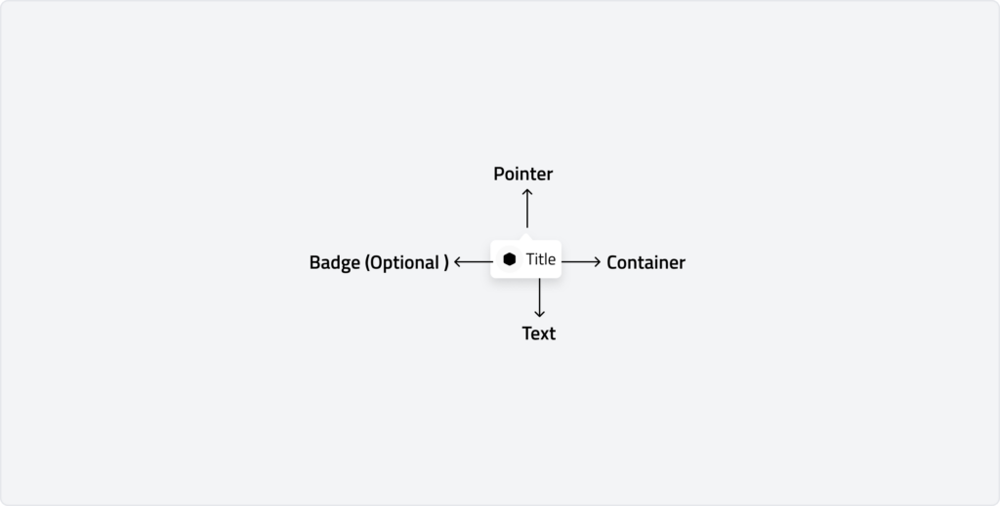
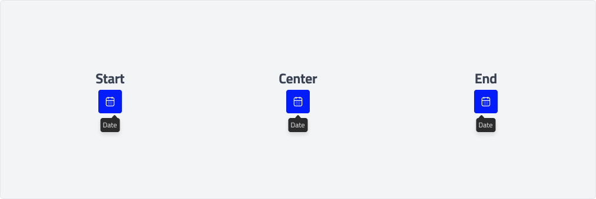
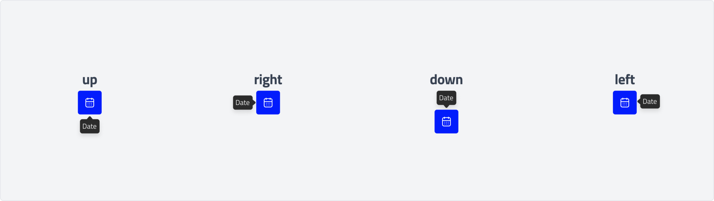
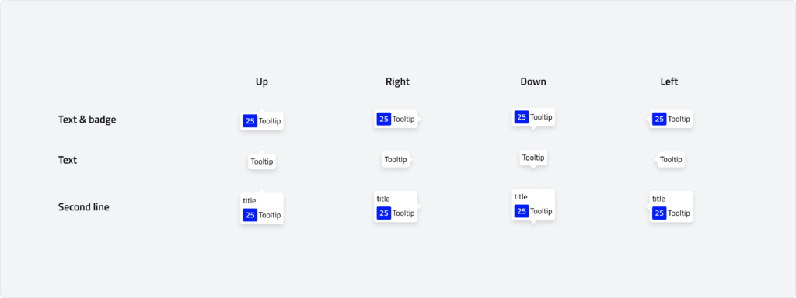

# Tooltip (Bug)
A tooltip is a brief, informative message that appears when users hover over, focus on, or tap an element. It provides contextual help or additional details without cluttering the interface.
Tooltips enhance usability by offering guidance at the moment of need. While they are useful for clarifying functions or labels, they should be used sparingly to avoid overwhelming users.

---

## Overview

### Them
-   **Light Tooltip:** A light tooltip has a bright background with dark text, making it ideal for interfaces with light themes. It provides subtle guidance without drawing too much attention and ensures readability in well-lit UI environments.
-   **Dark Tooltip:** A dark tooltip features a dark background with light text, offering strong contrast and better visibility in dark-themed interfaces. It is useful for maintaining a seamless visual experience in low-light or dark mode settings.

### Line

-   #### One-Line Tooltip

    A one-line tooltip delivers a short and direct message in a single line. It is best used for brief explanations or hints without taking up much space.
-   #### Two-Line Tooltip

    A two-line tooltip provides additional context by allowing a second line of text. This format is useful when more detail is needed while maintaining clarity and readability.

### Anatomy

### Alignment

The tooltip container can be aligned to the start, center, or end to prevent it from extending off the page or overlapping important content.

### Placement

By default, tooltips are set to auto-position, automatically adjusting based on the edges of the browser to ensure they remain visible without getting cut off. However, tooltips can also be manually positioned to the right, left, top, or bottom of the trigger element. Avoid placing tooltips over crucial content that is important for the user's tasks, and ensure they do not extend off the page or hide behind other elements.

### Usage

Use a tooltip when additional information or context is needed without cluttering the interface. Tooltips help users understand actions, icons, or form fields without disrupting their workflow.\
Tooltips are commonly used for:

-   Clarifying icon meanings
-   Providing hints for form fields
-   Explaining button actions

When choosing between a tooltip and inline text, use a tooltip for supplementary information that appears on hover or focus, and use inline text when persistent guidance is required.

### Behaviour

